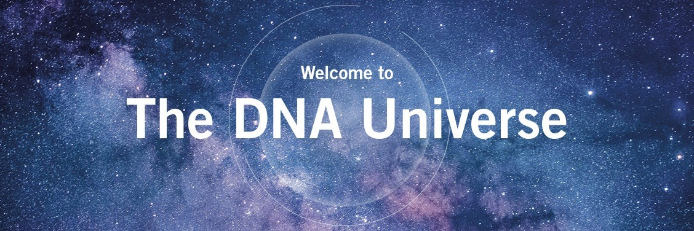

    

  
  
   

## Eurofins Genomics Latvia IT Solutions

    
Every day, we analyse and produce DNA for our wide-ranging network of customers that aim to make our world a safer, healthier place. In order to achieve this, we build the best possible teams by hiring, inspiring and challenging the best people around the world.

 
<b>Setting standards in the world of DNA.</b>  
We focus on delivering genomics products and services with the highest quality and making a difference in the lives of everyone who is touched by our business.

Our aim is to set benchmarks for the future of genomic services through our expertise and commitment.

<b>Fast</b>  
We produce and analyse DNA & RNA. As an an internationally leading company, we provide of DNA sequencing services, genotyping services, DNA synthesis products and bioinformatics services.

<b>Complete</b>  
We support our customers from research to application by combining outstanding expertise with state-of-the-art instruments, methods and technologies. We support standard and challenging research projects, as well as complex strategies for large interdisciplinary companies.

<b>Reliable</b>  
We work with academics, pharma, food, diagnostics, agriculture and biotechnology. Our highly automated and lean-optimised lab processes allow us to deliver highly-reliable results.    

## <a href="https://www.linkedin.com/company/eurofins-genomics-it-solutions-latvia/jobs">View jobs</a>

